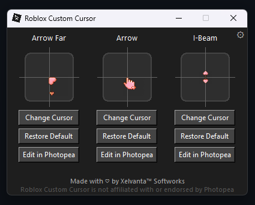
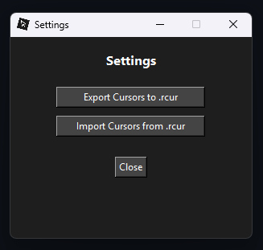
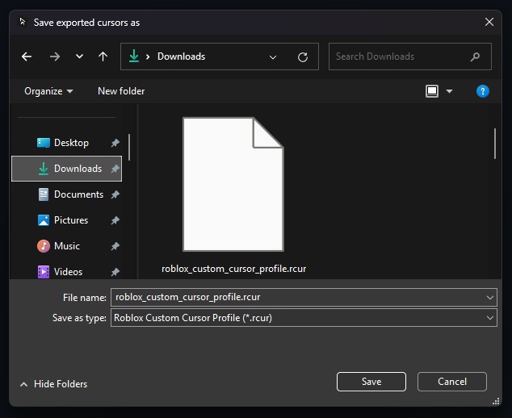

# 🖱️ Roblox Custom Cursor


<p align="left">
  
  <strong>Roblox Custom Cursor</strong> is a <strong>Windows-based Python application</strong> that allows you to customize the cursor on Roblox with your own image files. It offers an easy way to modify the default cursor and replace it with your choice of custom designs for a personalized experience. The program uses the <strong>Pillow</strong> library to handle cursor images.
</p>

---

## 📋 Requirements

Before running the application, ensure you have the following:

* **Python 3.x**

  * [Download Python](https://www.python.org/downloads/)
* **Pillow** (Python package for handling images)

  * Install it by running the following command:

    ```bash
    pip install pillow==11.1.0
    ```

---

## ⚙️ Installation

### 1. Clone the Repository:

```bash
git clone https://github.com/Xelvanta/roblox-custom-cursor
cd roblox-custom-cursor
```

### 2. Install Dependencies:

Make sure you have the necessary Python package installed:

```bash
pip install pillow==11.1.0
```

---

## ▶️ Running the Application

To run the **Roblox Custom Cursor** application:

1. Open a terminal and navigate to the project folder:

   ```bash
   cd roblox-custom-cursor
   ```

2. Run the script:

   ```bash
   python app.pyw
   ```

---

## 📸 Preview

<table>
  <tr>
    <td align="center">
      <br>Main GUI
    </td>
    <td align="center">
      <br>Settings
    </td>
    <td align="center">
      <br>Export .rcur
    </td>
    <td align="center">
      <br>Import .rcur
    </td>
  </tr>
</table>

---

## 💡 Contributing

Feel free to fork the project and submit pull requests to improve **Roblox Custom Cursor**. Contributions are welcome! See [CONTRIBUTING.md](CONTRIBUTING.md) for more information.

---

## 📝 License

**Roblox Custom Cursor** is open source and available under the GPL-3.0 license. See the [LICENSE](LICENSE) for more details.

---

By **Xelvanta**
For support or inquiries, please contact us at [Xelvanta@proton.me](mailto:Xelvanta@proton.me).
GitHub: [https://github.com/Xelvanta](https://github.com/Xelvanta)
