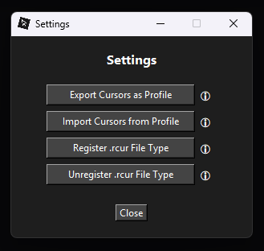
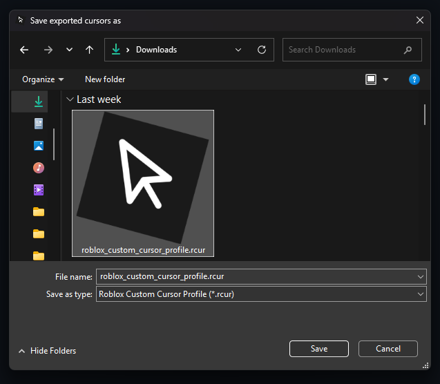
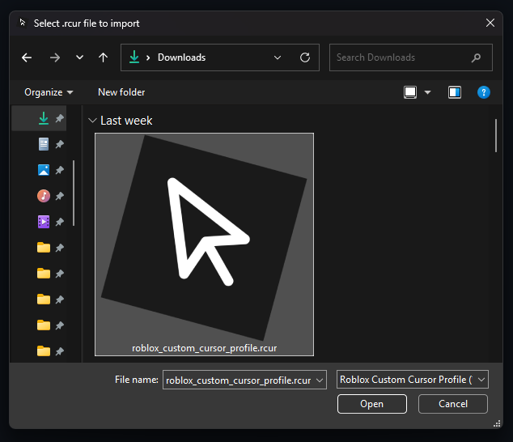

# 🖱️ Roblox Custom Cursor


<p align="left">
  
  <strong>Roblox Custom Cursor</strong> is a <strong>100% self-contained Windows-based Python application</strong> designed for easy cursor customization on Roblox.  
  The entire functionality is bundled into a single <code>app.pyw</code> file.  
  The only external requirements are <strong>Python 3.x</strong> and the <strong>Pillow</strong> library for image handling.
</p>

---

## 📋 Requirements

Before running the application, ensure you have:

* **Python 3.x**

  * [Download Python](https://www.python.org/downloads/)
* **Pillow** (Python package for handling images)

  * Install it by running:

    ```bash
    pip install pillow==11.1.0
    ```

---

## ⚙️ Installation

You can either **clone the repository** or **download the `app.pyw` file directly from the root directory**

### 1.
#### Clone the Repository:

```bash
git clone https://github.com/Xelvanta/roblox-custom-cursor
cd roblox-custom-cursor
```

### OR

#### Download the `app.pyw` File Directly:

Download the latest `app.pyw` file https://github.com/Xelvanta/roblox-custom-cursor/  and save it to a folder of your choice.

### 2. Install Dependencies:

Make sure Pillow is installed:

```bash
pip install pillow==11.1.0
```

---

## ▶️ Running the Application

To run the **Roblox Custom Cursor** app:

1. Open a terminal and navigate to the folder containing `app.pyw`
2. Run the script:

```bash
python app.pyw
```

**Or simply double-click `app.pyw` in your file explorer to launch the app directly — no terminal needed!**

---

## 🗂️ `.rcur` File Type Support

The `.rcur` file is a custom plaintext format that holds the three cursor images used by **Roblox**. You can:

* **Export** your current cursor setup as a `.rcur` file for backup or sharing.
* **Import** a `.rcur` file to quickly apply a saved cursor configuration.

If you **associate the `.rcur` file type with windows** via the Settings menu (top-right), you can simply **double-click any `.rcur` file** in Windows Explorer to import it directly — no need to open the main application first.

---


## 📸 Preview

<table>
  <tr>
    <td align="center">
      <br>Main GUI
    </td>
    <td align="center">
      <br>Settings
    </td>
    <td align="center">
      <br>Export .rcur
    </td>
    <td align="center">
      <br>Import .rcur
    </td>
  </tr>
</table>

---

## 💡 Contributing

Feel free to fork the project and submit pull requests to improve **Roblox Custom Cursor**. Contributions are welcome! See [CONTRIBUTING.md](CONTRIBUTING.md) for more information.

---

## 📝 License

**Roblox Custom Cursor** is open source and available under the GPL-3.0 license. See the [LICENSE](LICENSE) for details.

---

By **Xelvanta**
For support or inquiries: [Xelvanta@proton.me](mailto:Xelvanta@proton.me)  
GitHub: [https://github.com/Xelvanta](https://github.com/Xelvanta)