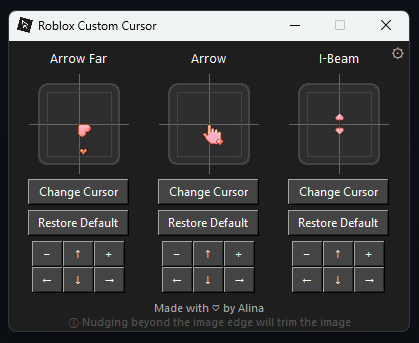
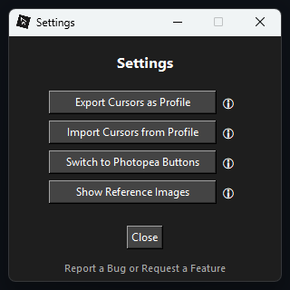
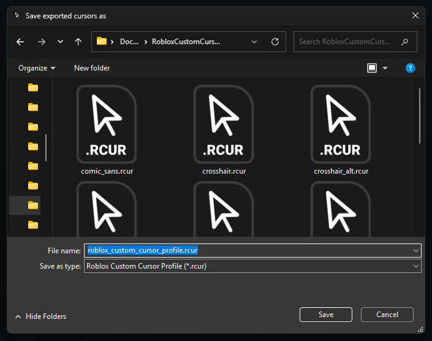
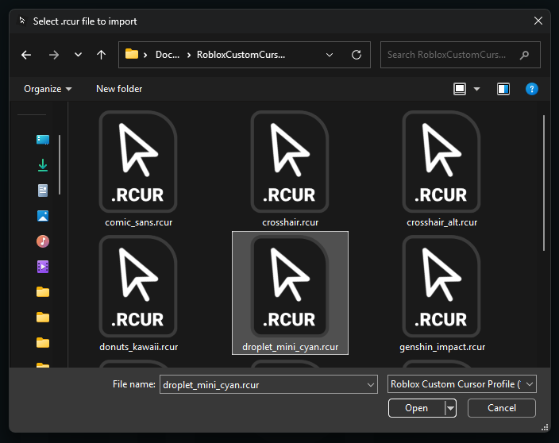
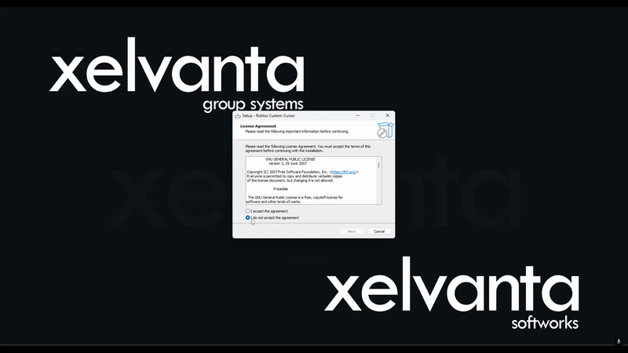
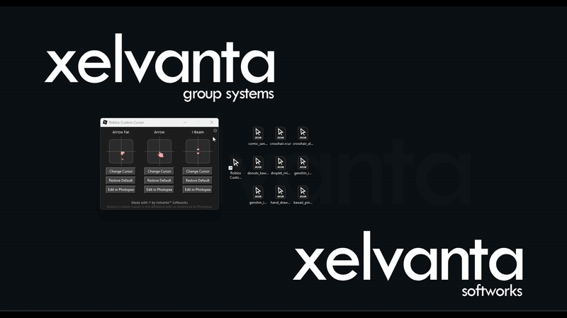
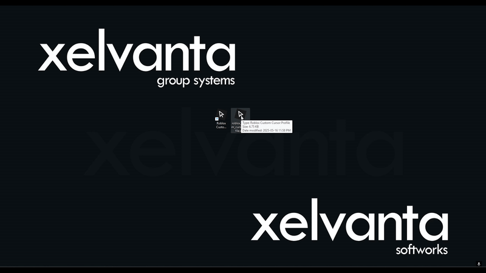

# 🖱️ Roblox Custom Cursor v3

  
  <strong>Roblox Custom Cursor</strong> is a lightweight Windows application that makes it easy to customize your Roblox cursors with custom PNGs. 
  Version 3 introduces a rewrite with a user-friendly setup wizard for streamlined installation.

---

## ✨ What’s New in Version 3

- 🔧 **Installer Wizard** – Easy installation with `RCC3_Installer.exe`
- 🗃️ **New File Structure** – Assets, launcher, and data files reorganized for clarity
- 💡 **Improved Registry Integration** – File associations now handled reliably through installer

---

## 📋 Requirements

None!  

**Roblox Custom Cursor v3** bundles everything you need — including Python and all required dependencies. You do **not** need to install Python or pip separately. Just run the installer and you're good to go.

---

## ⚙️ Installation

### 🖱️ Download and Run the Installer

1. Download and run [RCC3_Installer.exe](https://github.com/Xelvanta/roblox-custom-cursor/raw/refs/heads/main/app/RCC3_Installer.exe).
2. Follow the setup wizard instructions.

After installation, **Roblox Custom Cursor** can be launched from the **Start Menu** or **desktop shortcut**.

---

## 📦 Features

* 🖼️ **Custom Cursor Support** – Upload any transparent PNG to use as your Roblox cursor
* 📐 **Built-in Alignment Guide** – Launch edits in Photopea with grid overlay
* 🔁 **Import/Export** `.rcur` **Profiles** – Share and back up your cursor layouts
* ⚡ **Double-Click .rcur to Apply** – Instantly switch layouts from File Explorer
* ♻️ **One-Click Reset** – Restore default Roblox cursors in seconds
* 🧼 **Clean UI** – Intuitive interface designed for accessibility and speed
* 🪶 **Lightweight & Fast** – Runs smoothly on almost any Windows machine

---

## 📂 `.rcur` File Association

`.rcur` files store all 3 cursor PNGs in one package. After installation, these files are:

* ✅ Registered to open with **Roblox Custom Cursor**
* ✅ Double-clickable to apply directly
* ✅ Backwards-compatible for import/export

### 🎨 Premade Profiles Included

For convenience, several ready-to-use `.rcur` profiles are provided in the [examples/](https://github.com/Xelvanta/roblox-custom-cursor/tree/main/examples) directory.  
You can import these profiles either via the main app under **Settings > Import Cursors from Profile**, or by double-clicking the `.rcur` file in your file explorer to apply it immediately.

---

## 🧪 Preview

<table>
  <tr>
    <td align="center">
       Main GUI
    </td>
    <td align="center">
       Settings
    </td>
    <td align="center">
       Export .rcur
    </td>
    <td align="center">
       Import .rcur
    </td>
  </tr>
</table

<table align="center" style="margin-top: 20px;">
  <tr>
    <td align="center">
      
       Install Wizard Preview GIF  
    </td>
  </tr>
  <tr>
    <td align="center">
      
       Export/Import Preview GIF  
    </td>
  </tr>
  <tr>
    <td align="center">
      
       .rcur Direct Import Preview GIF
    </td>
  </tr>
</table>

---

## 🛠️ Advanced Use (Power Users)

The `.rccapp` file format is a renamed Python `.pyw` script executed using the embedded Python interpreter bundled in the installer.

If you want to experiment with **running the app using your own Python**, you can:

- Rename files with the `.rccapp` extension to use `.pyw`
- Manually run it with your own Python install (make sure required libraries like Pillow are installed)
- Update registry key values if needed

> ⚠️ This is **unsupported** and recommended only for advanced users.  
> The official version is designed to work out-of-the-box with embedded Python for consistency and ease of use.

---

## 💡 Contributing

Contributions are welcome! Help us improve **Roblox Custom Cursor** by submitting pull requests or reporting issues.

---

## 📝 License

**Roblox Custom Cursor** is open source under the [GPL-3.0 License](LICENSE).

---

By **Xelvanta**  
📫 [Xelvanta@proton.me](mailto:Xelvanta@proton.me)  
🌐 [github.com/Xelvanta](https://github.com/Xelvanta)
