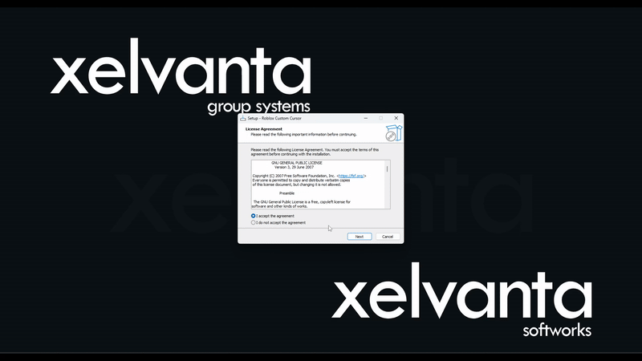
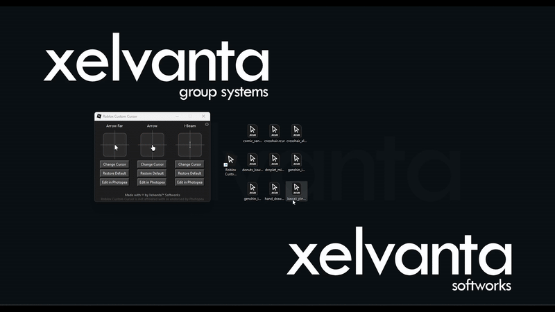

# 🖱️ Roblox Custom Cursor

  

  
  <strong>Roblox Custom Cursor</strong> is a lightweight Windows application that allows you to fully customize your Roblox cursors with your own PNG images.  
  A simple setup wizard ensures the installation is fast and straightforward.

---

## 📋 Requirements

None!

All dependencies, including Python, are bundled with the installer. You do **not** need to install Python or pip separately. Simply run the installer and get started.

---

## ⚙️ Installation

1. Download and run [RCC3_Installer.exe](https://github.com/Xelvanta/roblox-custom-cursor/releases/latest/download/RCC3_Installer.exe).
2. Follow the setup wizard instructions.

After installation, launch **Roblox Custom Cursor** from the **Start Menu** or your **desktop shortcut**.

---

## 📦 Key Features

* 🖼️ **Custom Cursor Support** – Use any transparent PNG as your Roblox cursor.
* ✏️ **In-App Editing** – Adjust and preview your cursors directly within the app.
* 🔁 **Import/Export Profiles (`.rcur`)** – Share and back up cursor layouts easily.
* ⚡ **Instant Apply** – Double-click `.rcur` files to switch cursors immediately.
* ♻️ **One-Click Reset** – Restore Roblox’s default cursors in seconds.
* 🧼 **Clean UI** – Intuitive interface for accessibility and speed.
* 🪶 **Lightweight & Fast** – Optimized for smooth performance on Windows.

### ⚠️ Important Note About Roblox Updates

When **Roblox updates**, your **custom cursors will be replaced** with the **default Roblox cursor set**.
To restore your design quickly, it is **strongly recommended** to **export your cursor set to a `.rcur` file** through the Settings menu.

You can **double-click your `.rcur` file at any time** to instantly reapply your custom cursors — no need to open the main application.

---

## 📂 `.rcur` File Association

  
  <strong>.rcur</strong> files store all three cursor images in a single compact file. Once installed: 

* ✅ Registered to open with **Roblox Custom Cursor**
* ✅ Double-clickable to apply immediately, even without opening the main application
* ✅ Compatible with versions 3.5.0.0 and later

### 🎨 Premade Profiles

As of version **4.6.0.0**, several ready-to-use `.rcur` profiles are accessible **directly in-app** through the **Catalogue** button located below the **Settings** button.  
You can also continue to import `.rcur` files manually by double-clicking them or using **Settings > Import Cursors from Profile**.

---

## 🧪 Preview

<table>
  <tr>
    <td align="center">
       Main GUI
    </td>
    <td align="center">
       Settings
    </td>
    <td align="center">
       Export .rcur
    </td>
    <td align="center">
       Import .rcur
    </td>
  </tr>
</table>

<table align="center" style="margin-top: 20px;">
  <tr>
    <td align="center">
      
       Install Wizard Preview  
    </td>
  </tr>
  <tr>
    <td align="center">
      
       Export/Import Preview  
    </td>
  </tr>
  <tr>
    <td align="center">
      
       .rcur Direct Import Preview
    </td>
  </tr>
</table>

---

## 🛠️ Advanced Use (Power Users)

The `.rccapp` format is a renamed Python `.pyw` script executed using the embedded Python interpreter bundled in the installer.

Advanced users can:

* Rename `.rccapp` files to `.pyw` and run with their own Python environment (requires Pillow and dependencies)
* Manually adjust registry keys if needed

> ⚠️ Unsupported. Official versions are optimized to work out-of-the-box with embedded Python.

---

## 🔒 Privacy

The developer has disclosed that **Roblox Custom Cursor does not collect, transmit, or sell any personal information**.

* No telemetry or analytics are performed.
* All settings and profiles remain local.
* As of version **4.6.0.0**, the optional **Catalogue** feature may connect to the GitHub API to fetch pre-made cursor profiles.

  * Triggered **only** when the Catalogue is opened.
  * No user data is transmitted.

Full details are available in the [Privacy Policy](PRIVACY).

---

## 💡 Contributing

[Contributions](CONTRIBUTING.md) are welcome! Improve **Roblox Custom Cursor** by [submitting pull requests](https://github.com/Xelvanta/roblox-custom-cursor/compare) or [reporting issues](https://github.com/Xelvanta/roblox-custom-cursor/issues/new).

---

## 📝 License

**Roblox Custom Cursor** is open source under the [GPL-3.0 License](LICENSE).

---

By **Xelvanta**
📫 [Xelvanta@proton.me](mailto:Xelvanta@proton.me)
🌐 [github.com/Xelvanta](https://github.com/Xelvanta)
